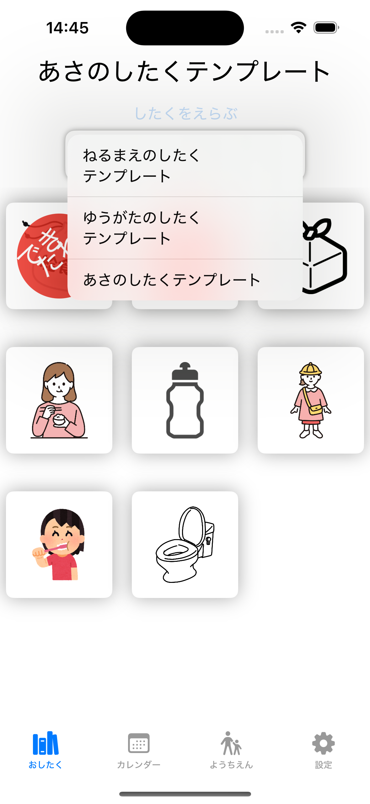
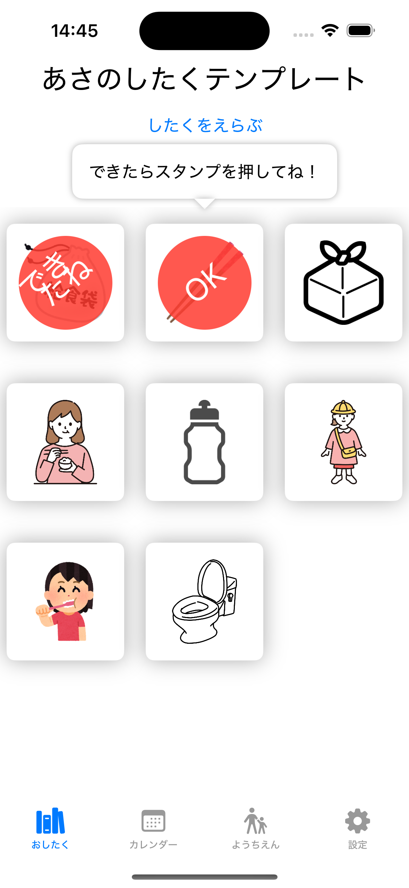
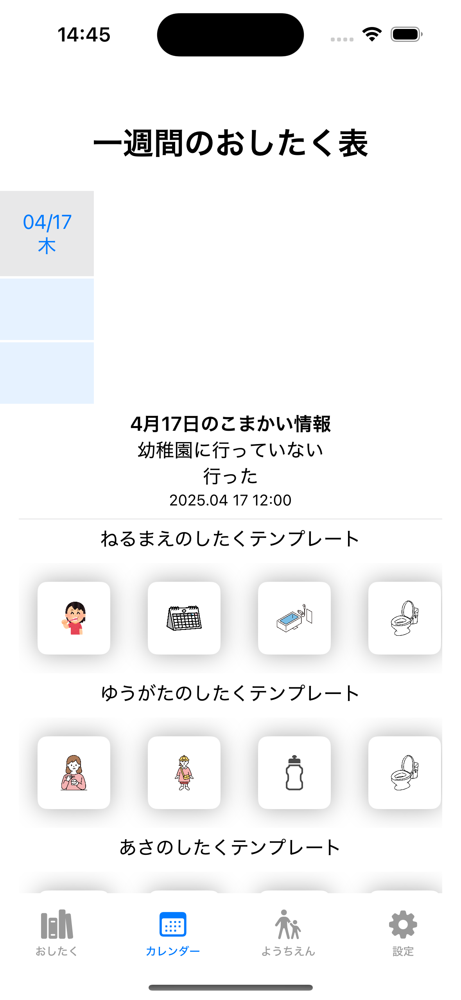
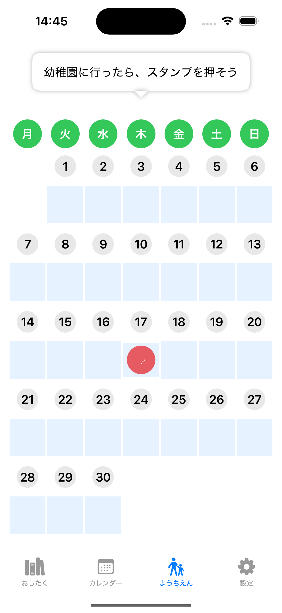
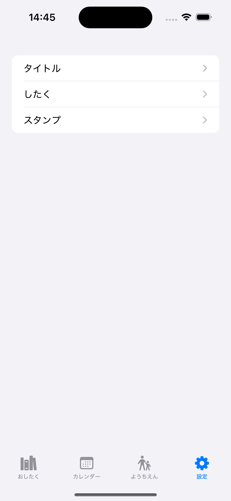
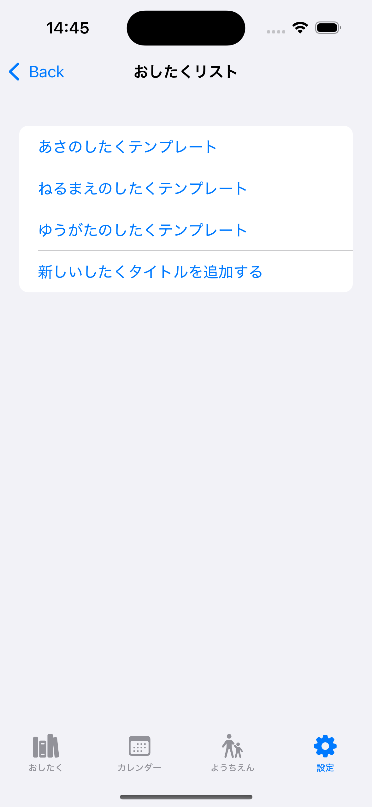
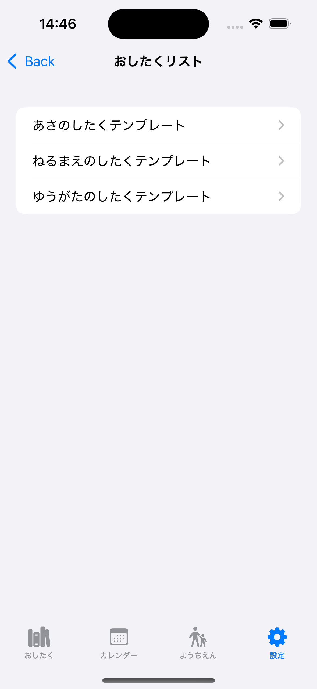
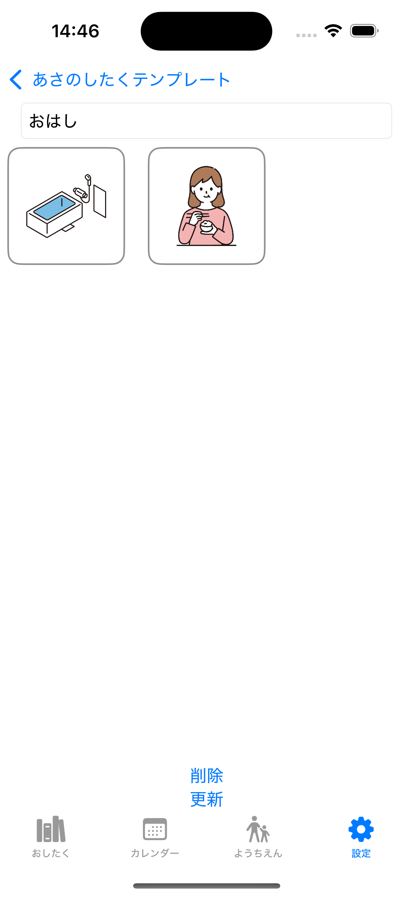

# 子どものお支度管理アプリ

## 📱 iOSアプリの紹介

本アプリでは、子どもの「おしたく習慣」をサポートするための画面を用意しています。
自分で取り組んで、できた！を実感できる、シンプルで使いやすいデザインです。

## 🧒 おしたく画面
<p align="center">
  
  
</p>
「あさのしたく」「ねるまえのしたく」などのリストから選択すると、したくアイコン一覧が表示されます。
各アイコンをタップすると、スタンプが描画され、子どもが「したくができた！」と実感できます。
すべての支度が完了すると、大きく「OKスタンプ」が表示され、ご褒美感覚で達成感を味わえます。
※すべての子どもに当てはまるわけではありませんが、楽しく自発的な行動につながることもあります。

## 📅 カレンダー画面
<p align="center">
  
</p>
「おしたく画面」での取り組みを日ごとに確認できます。
日付のセルをタップすると、その日の詳細情報を表示できます。
読んだ本や、その日の気分なども自由に編集できます。

## 🏫 ようちえん画面
<p align="center">
  
</p>
幼稚園に行った日をカレンダーで確認できます。
日時のセルをタップして、スタンプをカレンダーに描画できます。


## ⚙️ 設定画面
<p align="center">
  
  
  
  
</p>
「おしたく」のタイトルや詳細内容を編集可能です。
「おしたく」のアイコンを編集・削除することもできます。
将来的には、スタンプの選択機能も追加予定です。
必要なら、絵文字なしのバージョンや、画像と組み合わせた例も出せるよ。

## 使用技術

- SwiftUI
- SwiftData（ローカルデータ保存）
- Git / GitHub

## セットアップ手順

1. このリポジトリをクローン

```bash
git clone https://github.com/nainai0722/YourMoneyApp.git
```

---

### ✅ 今後の予定 / TODO

- [ ] Firebase 連携(お支度リスト情報を保存)
- [ ] 家族アカウント共有機能
- [ ] ダークモード対応


ご意見・リクエストも歓迎です 🙌

